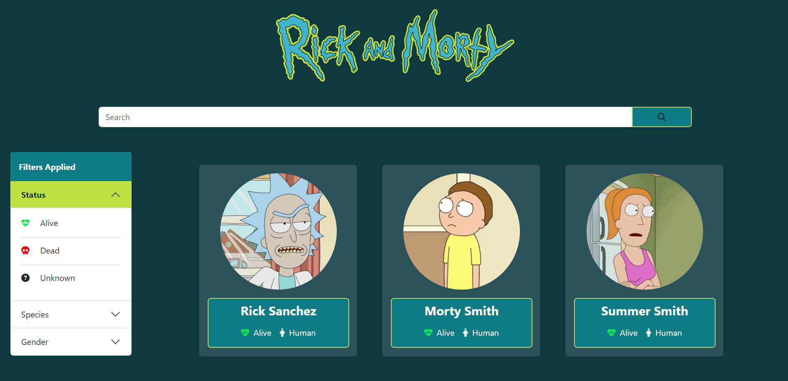

<a name="readme-top"></a>

<!-- PROJECT LOGO -->
<br />
<div align="center">
  <a href="https://github.com/github_username/repo_name">
    
  </a>

<h1 align="center">Rick And Morty</h1>
  <p>This project is a technical test for the Jump2Digital Hackathon 2023 <br>
  Learn More:    
    <a href="https://jump2digital.site/es/hackathon/">Jump2Digital</a>
  <br>
  <br>
    <strong>Project Description</strong>

  It showcases characters from the 'Rick and Morty' series using a public API and features responsive design, character search, filtering, and infinite scroll functionality.

  <p align="center">
    <a href="https://rick-and-morty-jump2digital.vercel.app/">View Demo</a>
  </p>
</div>


<!-- TABLE OF CONTENTS -->
<details>
  <summary>Table of Contents</summary>
  <ol>
    <li>
      <a href="#about-the-project">About The Project</a>
      <ul>
        <li><a href="#built-with">Built With</a></li>
      </ul>
    </li>
    <li>
      <a href="#getting-started">Getting Started</a>
      <ul>
        <li><a href="#installation">Installation</a></li>
        <li><a href="#development-server">Development server</a></li>
      </ul>
    </li>
    <li><a href="#roadmap">Roadmap</a></li>
    <li><a href="#contact">Contact</a></li>
  </ol>
</details>


<!-- ABOUT THE PROJECT -->
## About The Project
<p align="center">
  
</p>


<p align="right">(<a href="#readme-top">back to top</a>)</p>


### Built With

* [![Angular][Angular.io]][Angular-url]
* [![Bootstrap][Bootstrap.com]][Bootstrap-url]

<p align="right">(<a href="#readme-top">back to top</a>)</p>


<!-- GETTING STARTED -->
## Getting Started


### Installation

1. Clone the repo
   ```sh
   git clone https://github.com/laradelrio/RickAndMorty.git
   ```
3. Install NPM packages
   ```sh
   npm install
   ```

### Development server

1. Run
   ```sh
   ng serve
   ```
  2. Navigate to `http://localhost:4200/`. The application will automatically reload if you change any of the source files.

<p align="right">(<a href="#readme-top">back to top</a>)</p>

<!-- ROADMAP -->
## Roadmap

- [X] Character showcase from 'Rick and Morty' series via public API.
- [X] Responsive design for a user-friendly experience.
- [X] Filter options for precise character selection.
- [X] Infinite scroll for seamless exploration.

<p align="right">(<a href="#readme-top">back to top</a>)</p>


<!-- CONTACT -->
## Contact

Lara Del Rio Garcia - lara.delrio333@gmail.com

Project Link: [https://github.com/laradelrio/RickAndMorty](https://github.com/laradelrio/RickAndMorty)

<p align="right">(<a href="#readme-top">back to top</a>)</p>


<!-- MARKDOWN LINKS & IMAGES -->
<!-- https://www.markdownguide.org/basic-syntax/#reference-style-links -->
[linkedin-shield]: https://img.shields.io/badge/-LinkedIn-black.svg?style=for-the-badge&logo=linkedin&colorB=555
[linkedin-url]: www.linkedin.com/in/lara-del-rio-garcia
[product-screenshot]: images/screenshot.png
[Angular.io]: https://img.shields.io/badge/Angular-DD0031?style=for-the-badge&logo=angular&logoColor=white
[Angular-url]: https://angular.io/
[Bootstrap.com]: https://img.shields.io/badge/Bootstrap-563D7C?style=for-the-badge&logo=bootstrap&logoColor=white
[Bootstrap-url]: https://getbootstrap.com